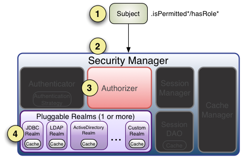

#### 1 流程



流程如下：

+ 1、首先调用Subject.isPermitted*/hasRole*接口，其会委托给SecurityManager，而SecurityManager接着会委托给Authorizer；

+ 2、Authorizer是真正的授权者，如果我们调用如isPermitted(“user:view”)，其首先会通过PermissionResolver把字符串转换成相应的Permission实例；

+ 3、在进行授权之前，其会调用相应的Realm获取Subject相应的角色/权限用于匹配传入的角色/权限；

+ 4、Authorizer会判断Realm的角色/权限是否和传入的匹配，如果有多个Realm，会委托给ModularRealmAuthorizer进行循环判断，如果匹配如isPermitted*/hasRole*会返回true，否则返回false表示授权失败。

##### 1.1 ModularRealmAuthorizer进行多Realm匹配流程
+ 1、首先检查相应的Realm是否实现了实现了Authorizer；

+ 2、如果实现了Authorizer，那么接着调用其相应的isPermitted*/hasRole*接口进行匹配；

+ 3、如果有一个Realm匹配那么将返回true，否则返回false。


##### 1.2 授权realm
> Realm进行授权的话，应该继承AuthorizingRealm

流程如下：
+ 1. 继承AuthorizingRealm
  - 1.1、如果调用hasRole*，则直接获取AuthorizationInfo.getRoles()与传入的角色比较即可；
  
  - 1.2、首先如果调用如isPermitted(“user:view”)，首先通过PermissionResolver将权限字符串转换成相应的Permission实例，默认使用WildcardPermissionResolver，即转换为通配符的WildcardPermission；
  
+ 2、通过AuthorizationInfo.getObjectPermissions()得到Permission实例集合；通过AuthorizationInfo.getStringPermissions()得到字符串集合并通过PermissionResolver解析为Permission实例；然后获取用户的角色，并通过RolePermissionResolver解析角色对应的权限集合（默认没有实现，可以自己提供）；
  
+ 3、接着调用Permission.implies(Permission p)逐个与传入的权限比较，如果有匹配的则返回true，否则false。 

```
public class AuthorizerRealm extends AuthorizingRealm {

	/**
	 * 获取权限信息
	 * @param principalCollection
	 * @return
	 */
	@Override
	protected AuthorizationInfo doGetAuthorizationInfo(PrincipalCollection principalCollection) {
		//创建权限信息实例
		SimpleAuthorizationInfo simpleAuthorizationInfo = new SimpleAuthorizationInfo();
        //添加角色
		simpleAuthorizationInfo.addRoles(Arrays.asList("role1","role2"));
        //添加权限
		simpleAuthorizationInfo.addObjectPermissions(Arrays.asList(new BitPermission("+user1+10"),new WildcardPermission("user1:*")));
		simpleAuthorizationInfo.addStringPermissions(Arrays.asList("+user2+8","user2:*"));

		return simpleAuthorizationInfo;
	}


	/**
	 * 获取认证信息
	 * @param authenticationToken
	 * @return
	 * @throws AuthenticationException
	 */
	@Override
	protected AuthenticationInfo doGetAuthenticationInfo(AuthenticationToken authenticationToken)
		throws AuthenticationException {
		//通过realm认证源，返回认证信息
		BaseRealm baseRealm = new BaseRealm();
		return baseRealm.getAuthenticationInfo(authenticationToken);
	}
}
```