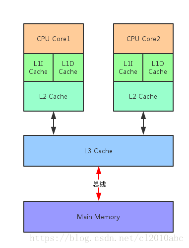
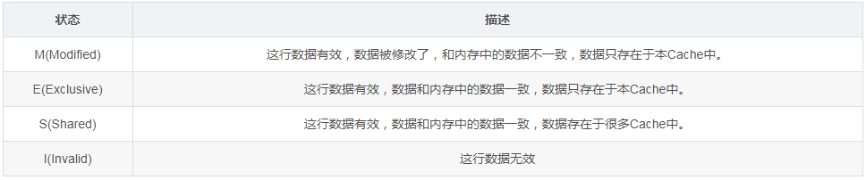
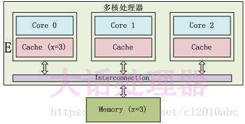
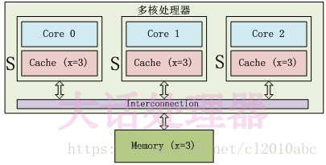
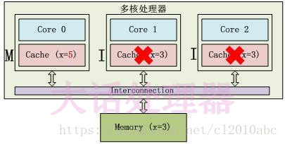
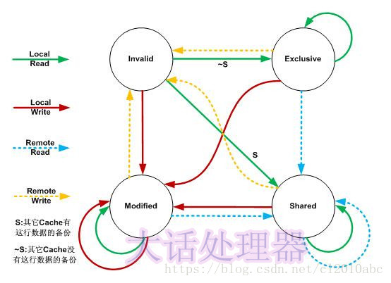
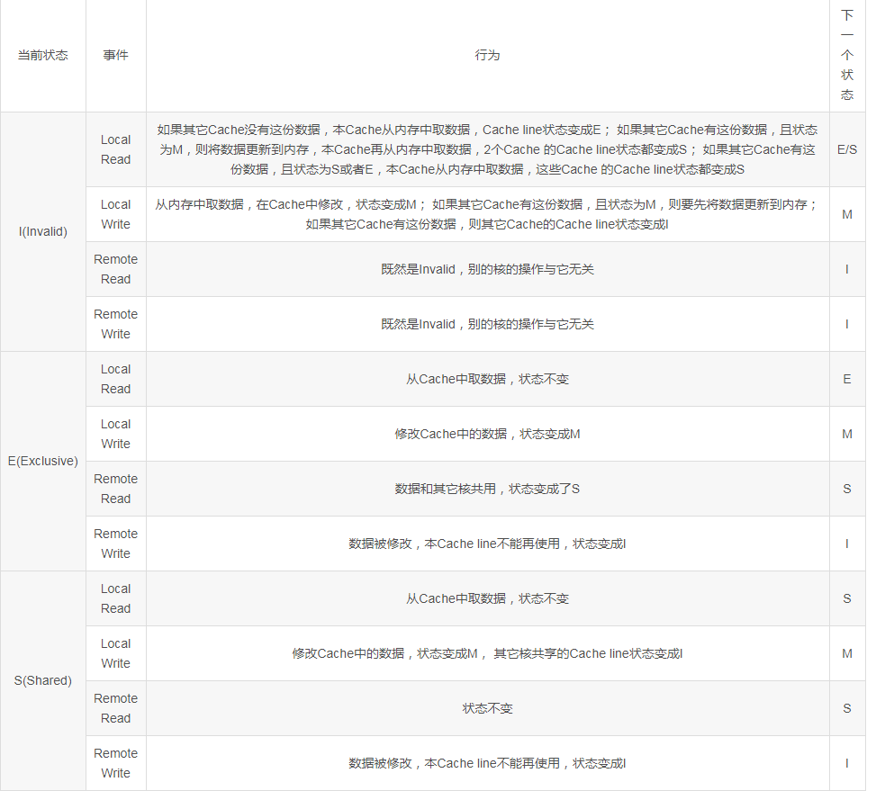
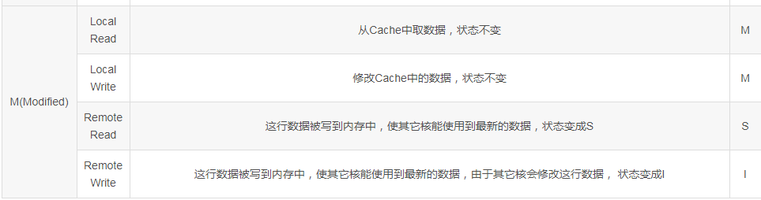

#### 并发
同时拥有两个或者多个线程，如果程序在单核处理器上运行，多个线程将交替的换入或者换出内存，这些线程
是同时“存在”的，每个线程都处于执行过程的某个状态，如果运行在多核处理器上，此时，程序中的每个线程
都将分配到一个处理器核上，因此可以同时运行。
> 多个线程操作相同的资源，保证线程安全，合适使用资源。

#### 高并发
通常指，通过设计保证系统能够同时并行处理很多请求。
> 服务能同时处理很多请求，提高程序性能。

#### 1 并发变成基础

##### 1.1 cpu多极缓存
现在的多核CPU的缓存一般都到了3级 

- 为什么需要CPU cache?
  cpu的频率太快，快到主存跟不上，这样在处理器的时钟周期内，cpu常常需要等待主存，浪费资源。
  所以cache的出现，是为了缓解cpu和内存之间速度的不匹配问题（cpu -> cache -> memory）
  
- cpu cache有何意义？
  + 1. 时间局部性：如果某个数据被访问，那么在不久的将来它很可能被再次访问;  
  + 2. 空间局部性：如果某个数据被访问，那么与它相邻的数据很快也可能被访问;
  
##### 1.2 cpu多极缓存-缓存一致性（MESI）  
> cache给系统带来性能上飞跃的同时，也引入了新的问题“缓存一致性问题”。设想如下场景（cpu一共有两个核，core1和core2）： 
以i++为例，i的初始值是0.那么在开始每个核都存储了i的值0，当第core1块做i++的时候，其缓存中的值变成了1，即使马上回写到主内存，那么在回写之后core2缓存中的i值依然是0，其执行i++，回写到内存就会覆盖第一块内核的操作，使得最终的结果是1，而不是预期中的2

- 为了达到数据访问的一致，需要各个处理器在访问缓存时遵循一些协议，在读写时根据协议来操作，常见的协议有MSI，MESI，MOSI等。我们介绍其中最经典的MESI协议。

  + 在MESI协议中，每个cache line有4个状态，可用2个bit表示，它们分别是：
  
  
  + E状态
  
  只有Core 0访问变量x，它的Cache line状态为E(Exclusive)。
  + S状态： 
  
  3个Core都访问变量x，它们对应的Cache line为S(Shared)状态。
  + M状态和I状态： 
  
  Core 0修改了x的值之后，这个Cache line变成了M(Modified)状态，其他Core对应的Cache line变成了I(Invalid)状态。
  + 协议时序图：
  在MESI协议中，每个Cache的Cache控制器不仅知道自己的读写操作，而且也监听(snoop)其它Cache的读写操作。每个Cache line所处的状态根据本核和其它核的读写操作在4个状态间进行迁移。 
  
  在上图中，Local Read表示本内核读本Cache中的值，Local Write表示本内核写本Cache中的值，Remote Read表示其它内核读其它Cache中的值，Remote Write表示其它内核写其它Cache中的值，箭头表示本Cache line状态的迁移，环形箭头表示状态不变。
  + MESI状态之间的迁移过程
  
  
##### 1.3 cpu多极缓存-乱序执行优化
- 处理器为提高运行速度而做出违背代码原有顺序的优化。

#### 2 java内存模型（jmm）
   https://blog.csdn.net/suifeng3051/article/details/52611310
   
##### 2.1 同步八种操作
- lock（锁定）：作用于主内存的变量，把一个变量标识为一条线程独占状态
- unlock（解锁）：作用于主内存的变量，把一个处于锁定状态的变量释放出来，释放后的变量才可以被其他线程锁定。
- read（读取）：作用与主内存的变量，把一个变量值从主内存传输到线程的工作内存中，以便随后的load动作使用
- load（加载）：作用与工作内存的变量，把read操作从主内存中得到的变量值放入工作内存的变量副本中。
- use（使用）：作用与工作内存的变量，把工作内存的一个变量值传递给执行引擎。
- assign（赋值）：作用与工作内存的变量，它把工作内存钟的一个变量的值传递到主内存钟，以便随后的write的操作
- store（存储）：作用与工作内存的变量，把工作内存钟的一个变量的值传送到主内存钟，以便随后的write操作
- write（写入）：作用与工作内存的变量，它把stroe操作从工作内存钟一个变量的值传送到主内存的变量中。

