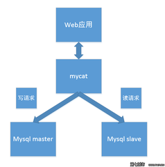
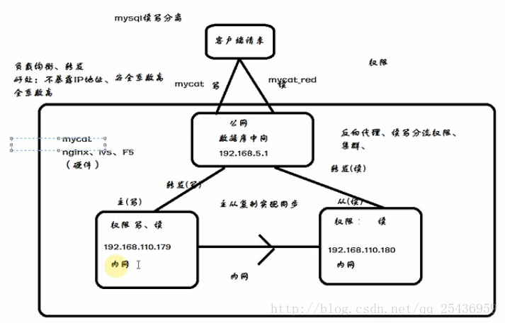

#### 1. 主从复制 
#### 2. 读写分离
#### 3. 分库/分表
  ##### 01.分库/分表方式
  - 垂直  
       将一张表拆分成多个表;
  - 水平  
       将一张表复制为多个表，根据一定的hash计算匹配;  
  ##### 02.分库/分表策略 
  - hash  
     
  - range  
    
  - list  
 
#### 4. 案例
  https://blog.csdn.net/wangshuang1631/article/details/68490115
  
#### 5. 实战

##### 5.1 环境
   - 架构
   
   - 原理
   
     
###### 5.1.1 主从安装
 - （mastr192.168.43.23,slave192.168.43.12）
 - 安装服务器命令
 ```
 yum install mysql-server
 yum install mysql-devel
 ```
 ```
   第一步：安装从网上下载文件的wget命令
   [root@master ~]# yum -y install wget
   第二步：下载mysql的repo源
   
   [root@master ~]# wget http://repo.mysql.com/mysql-community-release-el7-5.noarch.rpm 
   第三步：安装mysql-community-release-el7-5.noarch.rpm包
   
   [root@master ~]# rpm -ivh mysql-community-release-el7-5.noarch.rpm
   第四步：查看下
   
   [root@master ~]# ls -1 /etc/yum.repos.d/mysql-community*
   /etc/yum.repos.d/mysql-community.repo
   /etc/yum.repos.d/mysql-community-source.repo
   会获得两个mysql的yum repo源：/etc/yum.repos.d/mysql-community.repo，/etc/yum.repos.d/mysql-community-source.repo。
   
   第五步：安装mysql
   
   [root@master ~]# yum install mysql-server
 ```
 - 编辑mastr192.168.43.23 mysql配置文件
   ```
   vim  /etc/my.cnf  加入
   ```
   ```
    [mysqld]
    default-character-set=utf8//设置字符集
    server_id=23//服务id
    log-bin=mysql-bin//开启日志
   ```
 - 编辑slave192.168.43.12配置文件
   ```
    vim  /etc/my.cnf 
   ```
   ```
   [mysqld]
   default-character-set=utf8
   server_id=12
   log-bin=mysql-bin
   binlog_do_db=everyday//表示要同步的主机数据库实例是everyday
   ```
 - 启动
   ```
   systemctl start mysqld.service
   systemctl status mysqld.service
   systemctl stop mysqld.service
   systemctl restart mysqld.service
   ```
   > Failed to restart mysqld.service: Unit not found 解决方案为：
   ```
   首先需要安装mariadb-server   
   yum install -y mariadb-server 
   ```
 - 更改密码
 MySQL 默认创建了 root 用户的密码，这个密码打印在 MySQL 的日志文件/var/log/mysqld.log中，可以通过temporary password关键字来找出这个临时的密码。
 ```
 grep 'temporary password' /var/log/mysqld.log
 mysql -uroot -p 
  
 ```
 - 忘记密码
 > 如果mysql下没有user表，需要先执行mysql_install_db ;原因是安装问题.
 ```
  方法1： 用SET PASSWORD命令 
  首先登录MySQL。 
  格式：mysql> set password for 用户名@localhost = password(‘新密码’); 
  例子：mysql> set password for root@localhost = password(‘123’);
  
  方法2：用mysqladmin 
  格式：mysqladmin -u用户名 -p旧密码 password 新密码 
  例子：mysqladmin -uroot -p123456 password 123
  
  方法3：用UPDATE直接编辑user表 
  首先登录MySQL。 
  mysql> use mysql; 
  mysql> update user set password=password(‘123’) where user=’root’ and host=’localhost’; 
  mysql> flush privileges;
  
  方法4：在忘记root密码的时候，可以这样 
  以windows为例： 
  1. 关闭正在运行的MySQL服务。 
  2. 打开DOS窗口，转到mysql\bin目录。 
  3. 输入mysqld –skip-grant-tables 回车。–skip-grant-tables 的意思是启动MySQL服务的时候跳过权限表认证。 
  4. 再开一个DOS窗口（因为刚才那个DOS窗口已经不能动了），转到mysql\bin目录。 
  5. 输入mysql回车，如果成功，将出现MySQL提示符 >。 
  6. 连接权限数据库： use mysql; 。 
  6. 改密码：update user set password=password(“123”) where user=”root”;（别忘了最后加分号） 。 
  7. 刷新权限（必须步骤）：flush privileges;　。 
  8. 退出 quit。 
  9. 注销系统，再进入，使用用户名root和刚才设置的新密码123登录

 ```
 
 
###### 5.1.3 卸载
 - yum方式卸载
 ```
 yum list installed mysql*
 //根据检查结果卸载
 yum remove mysql-community-client mysql-community-common mysql-community-libs mysql-community-libs-compat mysql-community-server mysql57-community-release
 rm -rf /var/lib/mysql  
 rm /etc/my.cnf  
 ```
 - rpm方式卸载
 ```
 1. 查看安装
 rpm -qa | grep -i mysql  
 2. 卸载查询的组件
 rpm -e mysql57-community-release-el7-9.noarch
 rpm -e mysql-community-server-5.7.17-1.el7.x86_64
 rpm -e mysql-community-libs-5.7.17-1.el7.x86_64
 rpm -e mysql-community-libs-compat-5.7.17-1.el7.x86_64
 rpm -e mysql-community-common-5.7.17-1.el7.x86_64
 rpm -e mysql-community-client-5.7.17-1.el7.x86_64
 cd /var/lib/  
 rm -rf mysql/  
 3. 查看遗漏
 find / -name mysql（直接暴力删除）
 
 ```
 >[root@bigdata01 lib]# rpm -e mysql-community-libs-5.6.44-2.el7.x86_64
  错误：依赖检测失败：
  	libmysqlclient.so.18()(64bit) 被 (已安裝) postfix-2:2.10.1-7.el7.x86_64 需要
  	libmysqlclient.so.18(libmysqlclient_18)(64bit) 被 (已安裝) postfix-2:2.10.1-7.el7.x86_64 需要
    解决办法
 ```
 yum remove mysql-community mysql-community-server mysql-community-libs mysql-community-common
 ```
 
 